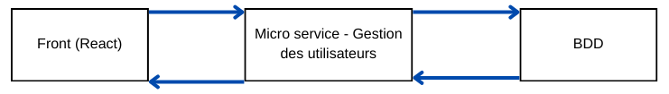

<h1> Microservice : Gestion des utilisateurs </h1>

<h2> Introduction </h2>

Ce microservice à pour objectif au sein de notre projet de gérer les utilisateurs qui vont utiliser notre application.

Il offre les fonctionnalités suivantes : 

* Permettre à tout utilisateur de créer un compte et de se connecter.

* Offrir aux administrateurs la possibilité de gérer les rôles des utilisateurs (ex. : utilisateur classique, médecin, administrateur, etc.).

Ce microservice garantit une gestion sécurisée des utilisateurs grâce à des mécanismes de validation et d'authentification.

 <h2> Architecture </h2>
 
 * Diagramme de l'architecture :
 
 
 
 * Les technologies utilisées : 
 
 Nous avons choisis pour ce microservice d'utiliser comme outils spring boot et java afin de développer un MVC et d'utiliser spring security afin des gérer les différents route et y mettre de la sécurité en même temps.
 
 * Les composants :
 
 Nous avons de ce fait différents composants dans ce microservice : 
 
<h5> Dans le package : entity </h5>
 
	- User (classe) : Il définie notre entité (présent donc dans la BDD avec les mêmes attibuts). 
	- RoleName (classe enum) : Il définie tout les rôles possibles pour les users. 
	
<h5> Dans le package : Dto </h5>

	- UserDto : Classe qui nous permet de transferer les données des Users entre par exemple les appels front et les appels à la BDD. 

<h5> Dans le package : repository </h5>

	-  UserRepository : Permet de définir les méthodes utiles pour accèder à notre entité User dans la BDD.
	
<h5> Dans le package : service </h5>

	- UserService : Une interface du servicequi nous permet de gérer les Users, elle permet de définir les méthodes avec 	leurs typages.
	- UserServiceImpl : La classe qui implémente l'interface UserService (notre service pour les Users).  
 
 <h5> Dans le package : request </h5>
 
	- UserRoleUpdateRequest : Classe qui nous permet de gérer les reqûetes de changement de rôles d'un User par un administrateur, cette classe est utile pour obtenir et traiter la requête entre le front et la microservice.
	 
<h5> Dans le package : security </h5>

	- AuthController : Controller qui permet de gérer la connexion des utilisateurs.
	- SecurityConfig : Classe qui nous permet des gérer les paramètres de sécurité comme le CORS et l'encodage des mots de passes.
	- UserAuthDto : Classe dto qui permet gérer les données des utilisateurs lors de la connexion.
	
<h5> Dans le package : controller </h5>

	- UserController : Controller qui permet de gérer les routes en ce qui concerne les Users.
	
<h5> Dans le package : project </h5>

	- MobisureApplication : Permet le lancement de l'application.

 <h2> Prérequis </h2>
 
 <h5> Environnement de développement : </h5>
 
	- Langage de programmation : Java 17
	- Build tool : Maven
	- IDE recommandé : Eclipse
 
<h5> Outils requis : </h5>

	- JDK 17 installé et configuré dans la variable d'environnement JAVA_HOME
	- Maven installé
	- Docker installé
 
 <h2> Installation </h2>
 
 * Exécution locale :
 
 * Exécution via Docker :
 
 <h2> Fonctionnalités </h2>
 
 * Liste des fonctionnalités principales :
 
 * Endpoints disponibles : 
 
 <h2> Sécurité </h2>
 
 <h2> Déploiement </h2>
 
 <h2> Tests </h2>